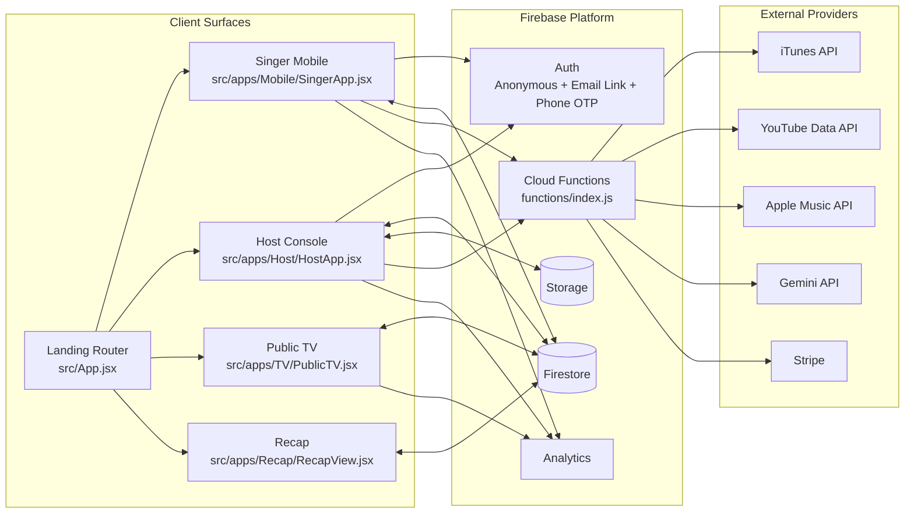
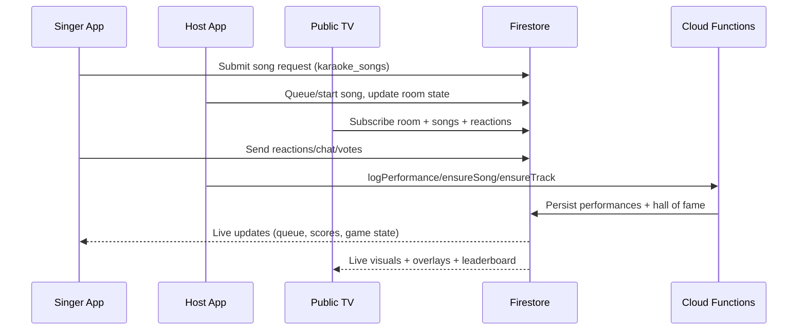

# Architecture Overview

As of 2026-02-08, this repository implements a multi-screen karaoke platform with real-time room state, game modes, and payment-backed points.

## System Topology

## Core Data Domains

Main real-time room state is under:

- `artifacts/bross-app/public/data/rooms`
- `artifacts/bross-app/public/data/room_users`
- `artifacts/bross-app/public/data/karaoke_songs`
- `artifacts/bross-app/public/data/reactions`
- `artifacts/bross-app/public/data/activities`
- `artifacts/bross-app/public/data/chat_messages`
- `artifacts/bross-app/public/data/selfie_submissions`
- `artifacts/bross-app/public/data/selfie_votes`
- `artifacts/bross-app/public/data/doodle_submissions`
- `artifacts/bross-app/public/data/doodle_votes`

Global and historical catalog/leaderboard data:

- `users`
- `songs`
- `tracks`
- `song_lyrics`
- `performances`
- `song_hall_of_fame`
- `song_hall_of_fame_weeks`

## Runtime Modes and Routing

`src/App.jsx` routes by URL query/path:

- `?mode=mobile&room=CODE` -> Singer app
- `?mode=host&room=CODE` -> Host app
- `?mode=tv&room=CODE` -> TV display
- `?mode=recap&room=CODE` -> Recap view
- `/karaoke/terms` -> Terms screen

## Primary Request and Event Flow

## Cloud Functions Boundary

Key callable endpoints in `functions/index.js`:

- Discovery/metadata: `itunesSearch`, `youtubeSearch`, `youtubePlaylist`, `youtubeStatus`, `youtubeDetails`
- AI content: `geminiGenerate`
- Catalog normalization: `ensureSong`, `ensureTrack`
- Performance persistence: `logPerformance`
- Payments: `createPointsCheckout`, `createTipCrateCheckout`, `stripeWebhook`
- Media/lyrics: `appleMusicLyrics`, `autoAppleLyrics`, `createAppleMusicToken`
- Utility: `googleMapsKey`

## Game Architecture

Game metadata and mappings:

- Registry: `src/lib/gameRegistry.js`
- Host launcher/config shell: `src/components/UnifiedGameLauncher.jsx`
- Implementations: `src/games/*/Game.jsx`

Host sets room-level `activeMode` + `gameData`; Singer/TV react to the same shared state.

## Billing Architecture

- Client abstraction: `src/billing/provider.js`
- Product catalog: `src/billing/catalog.js`
- Web flow: Stripe Checkout (server-issued session + webhook fulfillment)
- iOS flow: scaffolded, not fully wired end-to-end yet (`docs/billing-iap.md`)

## Security Model Snapshot

From `firestore.rules`:

- Public read for room/public experience docs and global leaderboards.
- Authenticated writes for `artifacts/{appId}/public/data/**`.
- User profile writes restricted to owner UID.
- Sensitive catalog/leaderboard writes blocked client-side; server writes via Admin SDK.

## Deployment Units

- Frontend: Vite build (`npm run build`) deployed as static app.
- Backend: Firebase Functions v2 (Node) in `us-west1`.
- Shared identity: `APP_ID = bross-app` in `src/lib/assets.js`.
