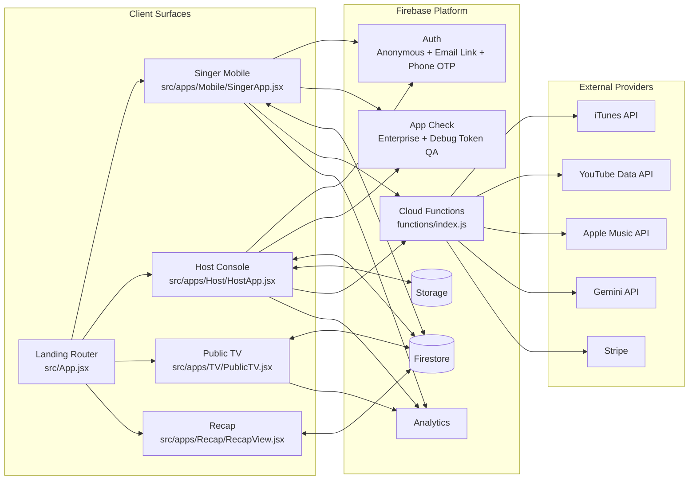
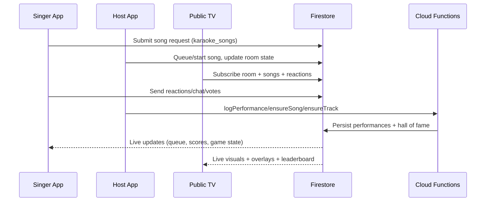

# Architecture Overview

As of 2026-02-08, this repository implements a multi-screen karaoke platform with real-time room state, game modes, and payment-backed points.

## System Topology

```mermaid
flowchart LR
    subgraph Clients[Client Surfaces]
        L[Landing Router\nsrc/App.jsx]
        M[Singer Mobile\nsrc/apps/Mobile/SingerApp.jsx]
        H[Host Console\nsrc/apps/Host/HostApp.jsx]
        T[Public TV\nsrc/apps/TV/PublicTV.jsx]
        R[Recap\nsrc/apps/Recap/RecapView.jsx]
    end

    subgraph Firebase[Firebase Platform]
        A[Auth\nAnonymous + Email Link + Phone OTP]
        AC[App Check\nEnterprise + Debug Token QA]
        F[(Firestore)]
        S[(Storage)]
        CF[Cloud Functions\nfunctions/index.js]
        AN[Analytics]
    end

    subgraph External[External Providers]
        IT[iTunes API]
        YT[YouTube Data API]
        AP[Apple Music API]
        GM[Gemini API]
        ST[Stripe]
    end

    L --> M
    L --> H
    L --> T
    L --> R

    M --> A
    H --> A
    M --> AC
    H --> AC

    M <--> F
    H <--> F
    T <--> F
    R <--> F

    H <--> S

    M --> CF
    H --> CF
    CF --> IT
    CF --> YT
    CF --> AP
    CF --> GM
    CF --> ST

    M --> AN
    H --> AN
    T --> AN
```

## Core Data Domains

Main real-time room state is under:

- `artifacts/bross-app/public/data/rooms`
- `artifacts/bross-app/public/data/room_users`
- `artifacts/bross-app/public/data/karaoke_songs`
- `artifacts/bross-app/public/data/reactions`
- `artifacts/bross-app/public/data/activities`
- `artifacts/bross-app/public/data/chat_messages`
- `artifacts/bross-app/public/data/selfie_submissions`
- `artifacts/bross-app/public/data/selfie_votes`
- `artifacts/bross-app/public/data/doodle_submissions`
- `artifacts/bross-app/public/data/doodle_votes`

Global and historical catalog/leaderboard data:

- `users`
- `songs`
- `tracks`
- `song_lyrics`
- `performances`
- `song_hall_of_fame`
- `song_hall_of_fame_weeks`

## Runtime Modes and Routing

`src/App.jsx` routes by URL query/path:

- `?mode=mobile&room=CODE` -> Singer app
- `?mode=host&room=CODE` -> Host app
- `?mode=tv&room=CODE` -> TV display
- `?mode=recap&room=CODE` -> Recap view
- `/karaoke/terms` -> Terms screen

## Primary Request and Event Flow

```mermaid
sequenceDiagram
    participant Singer as Singer App
    participant Host as Host App
    participant TV as Public TV
    participant FS as Firestore
    participant CF as Cloud Functions

    Singer->>FS: Submit song request (karaoke_songs)
    Host->>FS: Queue/start song, update room state
    TV->>FS: Subscribe room + songs + reactions
    Singer->>FS: Send reactions/chat/votes
    Host->>CF: logPerformance/ensureSong/ensureTrack
    CF->>FS: Persist performances + hall of fame
    FS-->>Singer: Live updates (queue, scores, game state)
    FS-->>TV: Live visuals + overlays + leaderboard
```

## Cloud Functions Boundary

Key callable endpoints in `functions/index.js`:

- Discovery/metadata: `itunesSearch`, `youtubeSearch`, `youtubePlaylist`, `youtubeStatus`, `youtubeDetails`
- AI content: `geminiGenerate`
- Catalog normalization: `ensureSong`, `ensureTrack`
- Performance persistence: `logPerformance`
- Payments: `createPointsCheckout`, `createTipCrateCheckout`, `stripeWebhook`
- Media/lyrics: `appleMusicLyrics`, `autoAppleLyrics`, `createAppleMusicToken`
- Utility: `googleMapsKey`

Key trigger-owned automations in `functions/index.js`:

- `autoPopTrivia`: creates Pop Trivia when a karaoke song doc is created
- scheduled pending recovery for stranded `popTriviaStatus: "pending"` songs
- room-level backfill when Pop Trivia is enabled after songs already exist

## Game Architecture

Game metadata and mappings:

- Registry: `src/lib/gameRegistry.js`
- Host launcher/config shell: `src/components/UnifiedGameLauncher.jsx`
- Implementations: `src/games/*/Game.jsx`

Host sets room-level `activeMode` + `gameData`; Singer/TV react to the same shared state.

## Billing Architecture

- Client abstraction: `src/billing/provider.js`
- Product catalog: `src/billing/catalog.js`
- Web flow: Stripe Checkout (server-issued session + webhook fulfillment)
- iOS flow: scaffolded, not fully wired end-to-end yet (`docs/billing-iap.md`)

## Security Model Snapshot

From `firestore.rules`:

- Public read for room/public experience docs and global leaderboards.
- Authenticated writes for `artifacts/{appId}/public/data/**`.
- User profile writes restricted to owner UID.
- Sensitive catalog/leaderboard writes blocked client-side; server writes via Admin SDK.

Operational enforcement:

- Production callables are App Check protected.
- The web client initializes App Check in `src/lib/firebase.js` and defaults production to reCAPTCHA Enterprise.
- Remote QA should use a registered App Check debug token instead of relying on headless browser attestation.

## Deployment Units

- Frontend: Vite build (`npm run build`) deployed as static app.
- Backend: Firebase Functions v2 (Node) in `us-west1`.
- Shared identity: `APP_ID = bross-app` in `src/lib/assets.js`.

## Pop Trivia Delivery Path

Pop Trivia is a karaoke overlay feature, distinct from the standalone `trivia_pop` game mode.

Terminology note:
- `QA` is no longer used as a product term.
- `trivia_pop` and `wyr` share the internal `PromptVote` cartridge for host-launched prompt rounds.
- `Pop Trivia` is the karaoke overlay that appears during songs.

Current flow:

1. Host enables `popTriviaEnabled` for the room.
2. A karaoke song doc is created under `karaoke_songs`.
3. Cloud Functions owns question generation and recovery.
4. Questions resolve from cache, Gemini, or deterministic fallback.
5. Audience (`SingerApp`) and TV (`PublicTV`) render the same active Pop Trivia state during `performing`.
6. Round timing comes from `room.gameDefaults.triviaRoundSec` with client fallback defaults.
