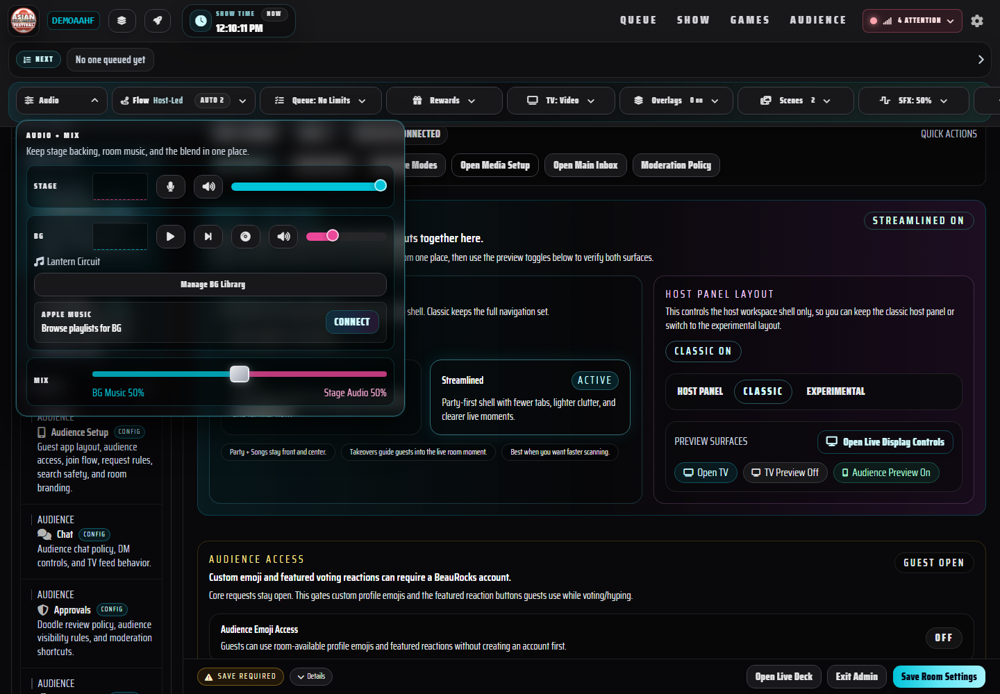
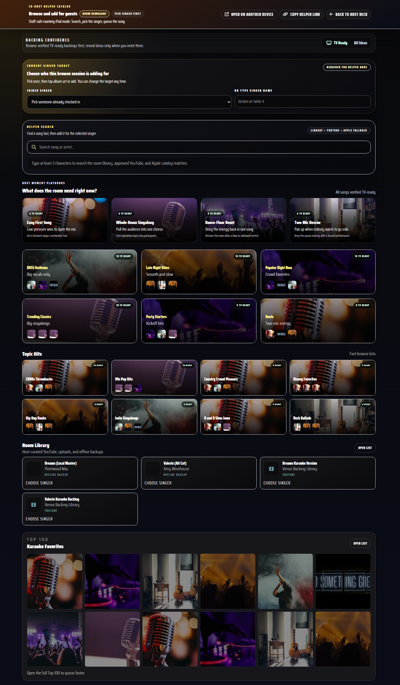
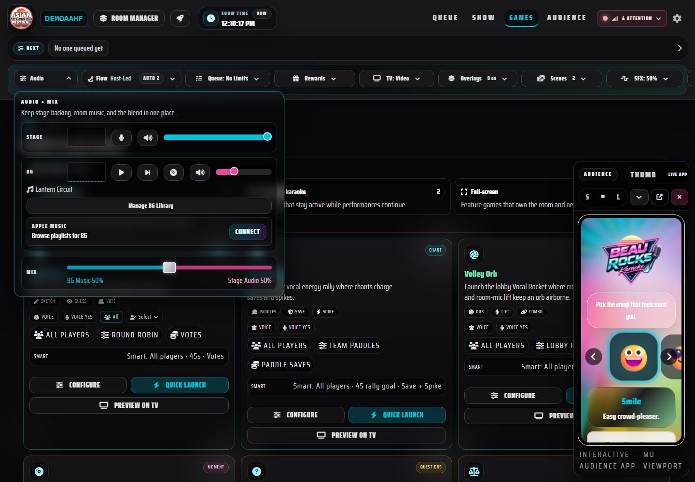
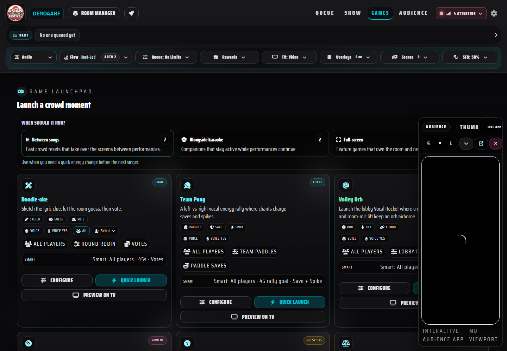
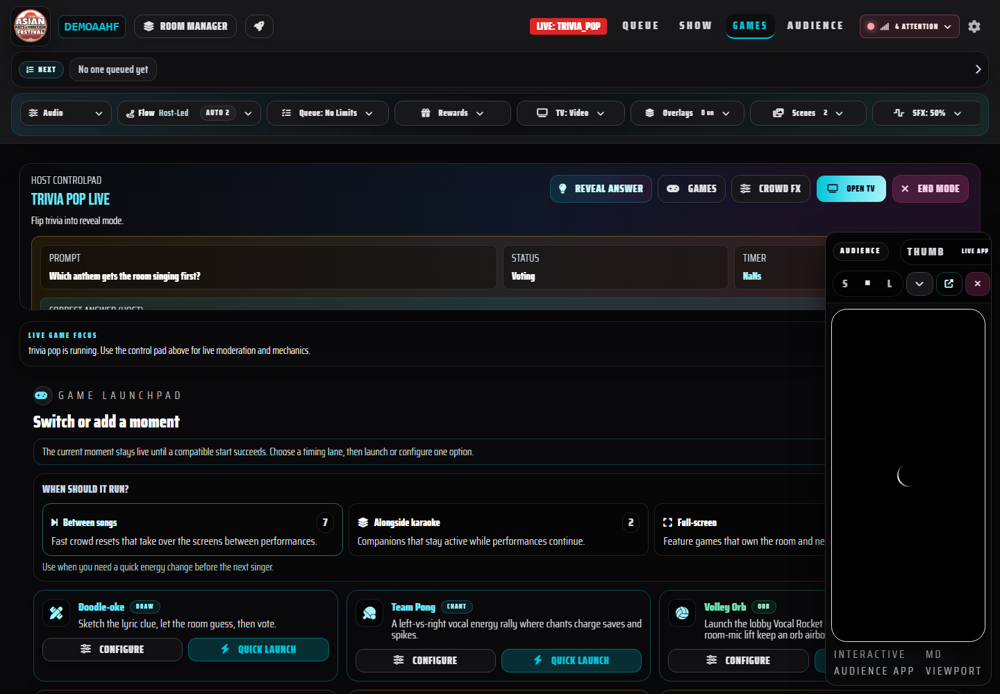
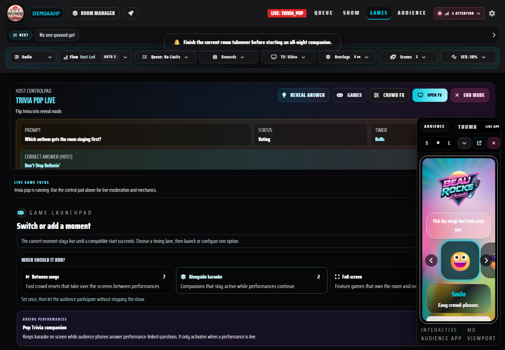
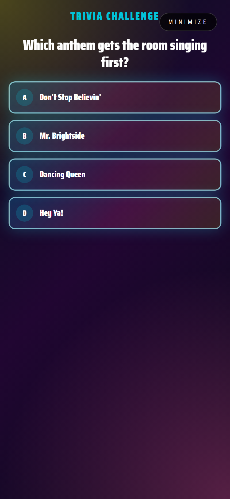
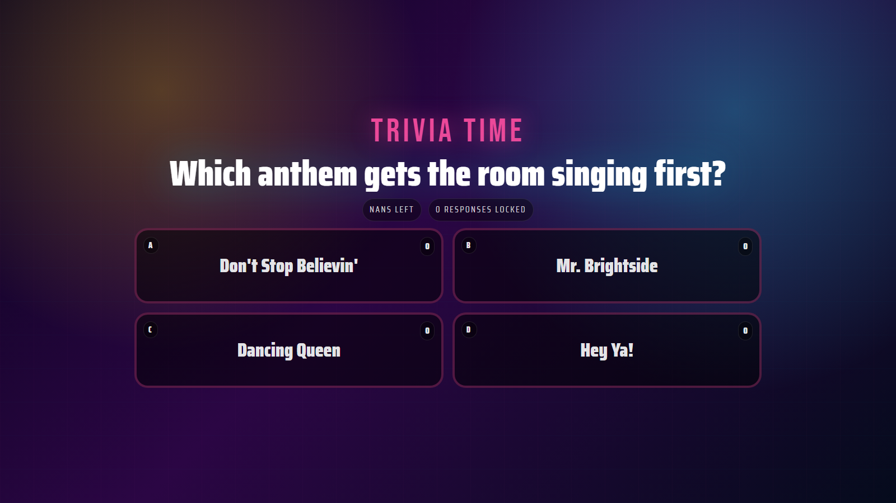

# BeauRocks Executive Progress Evidence

Date: 2026-07-12
Audience: Founder, CTO, Chief Product Officer, Chief Marketing Officer

## Executive Summary

The program has moved from a collection of capable but competing primitives toward a coherent operating system for a karaoke night. The strongest progress is now visible in three places: Hosts make fewer setup decisions, catalog results can represent one canonical song with multiple playable backings, and games are organized by when they belong in the night instead of by internal implementation category.

The production persona run validated room creation, Host game launch, TV game display, and return-to-karaoke recovery. It also isolated the next high-value gap: a brand-new audience browser can receive an active Trivia takeover before establishing room membership. The answers look actionable, but voting returns “Rejoin the room.” This is now the leading audience mental-load and conversion issue.

## Program Scorecard

| Workstream | Current state | Evidence | Remaining gap |
| --- | --- | --- | --- |
| Host catalog and content-agnostic media | Strong foundation | Unified catalog presentation, canonical song identity, alternate backings, source capability labels | Continue curated discovery and quota-resilient search evidence |
| Apple Music and background audio | Partially stabilized | Shared playback-source and background-audio state contracts | Complete end-to-end playback reliability and recovery QA |
| Room setup simplification | Materially improved | Guided launch decisions, operating-style and crowd-mode summaries, room/economy preview | Advanced controls still need progressive disclosure review |
| BeauBucks and event economics | Contract established | Canonical ledger vocabulary, server shadow entries, Points/BeauBucks separation | Complete operator reporting, reconciliation, and paid-event policy QA |
| Games and crowd interaction | Lifecycle unified and production-proven | Shared lifecycle slots, guarded Run of Show/direct/configured starts, Host timing bundles, Audience/TV guidance, and live collision acceptance | Package before/after evidence and measure Host timing-choice and two-action launcher recovery comprehension |
| Persona, design, and brand governance | Active | Cross-surface lifecycle language and deterministic screenshots | Formalize the recurring before/after review cadence |

## Measured Production Persona QA

Production path: authenticated dedicated QA Host, isolated room, Trivia, singer-sized browser, TV browser.

Validated:

- Host account created a real room successfully.
- Host reached the Game Launchpad and quick-launched Trivia.
- TV received and displayed the Trivia state.
- Host ended the mode and returned the room to karaoke cleanly.
- App Check and the low-privilege QA credential policy remained enforced.

Finding:

- A fresh audience browser saw the active Trivia player view before completing join/membership.
- Selecting an answer returned the visible recovery message “Rejoin the room.”
- The game takeover currently obscures the join path, so the user cannot easily satisfy that recovery instruction.

Classification at discovery: **P1 audience conversion and interaction gap**, not a deployment rollback issue. Host and TV control remained healthy and the room recovered cleanly.

Resolution checkpoint (2026-07-12):

- active takeover controls now wait for resolved room-user membership;
- new visitors receive a compact join-and-rules gate and return directly to the active game;
- the authenticated production rerun passed Host room creation, Trivia launch, singer join, singer vote, TV display, and return to karaoke with zero failed checks.

## Current Visual Evidence

### Room setup

The current screen is grounded in launch decisions and summaries rather than requiring the Host to understand every underlying field before starting.

### Catalog and browse

The current catalog experience is more visual, preserves Host navigation, and exposes source/playback capability while retaining canonical-song context.

### Game orchestration

The Game Launchpad now begins with the Host’s timing intent: Between songs, Alongside karaoke, or Full-screen rounds. Pop Trivia remains a performance companion instead of appearing as a competing standalone primitive.

### Current lifecycle closeout evidence (2026-07-13)

The Host starts from when a moment belongs in the night, while the active game cards retain quick launch, configuration, participant, reward, and preview context.

When a game is live, the controlpad and active lifecycle guidance remain primary. Alternate launch controls are available through one explicit `Open Launcher Drawer` action rather than competing with live moderation.

An incompatible start is rejected before room mutation and tells the Host what must finish. Production acceptance separately confirmed that the original live mode remains unchanged.

Audience and TV use the same lifecycle presentation contract: phones make the required choice while the room screen owns the shared prompt and reveal context.

## Before/After Product Narrative

| Area | Documented baseline | Current behavior | Success measure |
| --- | --- | --- | --- |
| Room setup | A long room-configuration screen introduced more questions than it answered | Start from a few consequential decisions; defer deeper configuration | New Host can explain what will happen before launching |
| Catalog | Entering a category displaced Host navigation and backings appeared as unrelated songs | Persistent Host chrome, visual results, canonical song with alternate versions | Host can browse, change course, and choose a playable backing without losing context |
| Economy | Points, contribution credits, and paid value could be conflated | Points communicate participation; BeauBucks communicate spendable event value | Guest and Host can explain what each balance represents |
| Games | Every primitive competed in one launcher and lifecycle ownership was implicit | Modes are grouped by when they run and share one phase/action/reveal contract | Host knows when to launch; audience knows what to do; TV knows what to reveal |

## Completed Bounded Slice

**Shared direct-launch lifecycle preflight and production collision closure**

- Run of Show, Quick Launch, and configured Host starts now use one room-aware preflight before live room mutation.
- Configuration, preview, scoring, winner, and clear operations remain available because they do not claim a live lifecycle slot.
- Production acceptance proved live Trivia blocks Bingo and remains `trivia_pop`.
- Production acceptance proved live Bingo blocks WYR and remains `bingo`.
- Both paths also passed Audience, TV, interaction, and End Mode checks.
- No game scoring, payload, Firestore schema, lifecycle persistence, or BeauBucks behavior changed.
- Final gates are 267 unit-test files / 947 tests, full lint with zero errors and the established warning baseline, a passing production build, and finalized Hosting release `d1581e4d336f5020`.

## Recommended Next Bounded Slice

**Persona-based before/after packaging and Host comprehension evidence**

Definition of done:

1. Use the current deterministic Host, Audience, and TV captures as the factual `after` state.
2. Pair them with the documented primitive-heavy baseline; do not fabricate unavailable historical screenshots.
3. Review the flow through CTO, Chief Product Officer, Chief Marketing Officer, Host, co-host, singer, and non-singer guest lenses.
4. Measure whether a Host can choose the correct timing bundle and return from live control to alternate launch controls in no more than two deliberate actions.
5. Keep mechanics, scoring, payloads, lifecycle schemas, and economy state unchanged during the evidence/design-review slice.

This is Sequence 6 of the established roadmap: convert shipped work into an executive decision artifact, expose remaining mental-load gaps, and only then authorize the next UI change.

## Deck-Ready 10-Slide Narrative

1. **BeauRocks north star** — content-agnostic at-home party game that helps Hosts and audiences delight each other.
2. **The original problem** — too many primitives, overlapping presets, unclear currency, and high live cognitive load.
3. **The operating architecture** — canonical song/media contracts, room policy domains, lifecycle registry, and guarded deployment.
4. **Room setup before/after** — from field inventory to consequential launch decisions.
5. **Catalog before/after** — album-forward discovery, persistent navigation, multiple sources, one canonical song.
6. **Content-agnostic reliability** — local files, Apple/Spotify discovery context, YouTube playback capability and quota posture.
7. **Points and BeauBucks** — participation reputation versus premium/event value and donation intent.
8. **Digital crowd fun** — three Host timing bundles with consistent Host, Audience, and TV lifecycle guidance.
9. **Production evidence** - 268 unit files / 951 tests, clean lint/build/release, membership recovery, compact-card limits, and two live collision-preservation paths.
10. **Practical roadmap** - package current before/after evidence, measure Host comprehension, then authorize only the next bounded mental-load fix.

## Evidence Integrity

- Host screenshots were generated from the current production build with deterministic QA fixtures at 1440 x 1000; Audience and TV use persona-appropriate viewports.
- The production persona result used a dedicated allowlisted QA Host and registered App Check debug token.
- No runtime application behavior was changed as part of this evidence report.
- Targeted QA tooling lint passes and the full regression suite passes (267 files / 947 tests).
- Authenticated production acceptance proved Trivia blocks Bingo and Bingo blocks WYR without changing the live mode, then completed Audience, TV, interaction, and End Mode checks.
- QA runner hardening rejects prose mistaken for room codes, waits for real answer controls and asynchronous feedback, and no longer treats a game overlay alone as proof of room membership.

## Compact Live Switcher Closeout and Deck Handoff (2026-07-13)

The persona-based game lifecycle review is complete and its single authorized UI follow-up is in production. The Host can recover alternate live-moment controls in two actions, keep the same three timing choices, and scan compact cards with no more than two buttons each. The standard setup launcher remains intact outside live switching.

Production Hosting release `8a0fc00146a6f351` passed the authenticated Trivia and Bingo matrix: Audience, interaction, TV, incompatible-start protection, live-state retention, and End Mode. The complete unit suite is `268` files / `951` tests; full lint and the production build pass.

The next bounded slice is the BeauRocks-branded 10-slide executive plan and PDF already defined in this report. It will combine the verified room setup, catalog, content-source, BeauBucks, and game-lifecycle evidence; label documented baselines honestly where historical screenshots are unavailable; and end with measured success criteria rather than authorizing another broad implementation wave.

## Executive 10-Slide Artifact Completion (2026-07-13)

Sequence 6 is complete. The BeauRocks-branded executive plan is available as an editable HTML source and final 10-page 16:9 PDF:

- `decks/2026-07-13-beaurocks-executive-plan.html`
- `decks/2026-07-13-beaurocks-executive-plan.pdf`

The render gate verified all ten slide canvases, generated per-slide visual previews, rejected out-of-bounds content, and confirmed the PDF at 960 × 540 points. The artifact uses verified current screenshots and clearly labeled documented baselines; it does not invent historical UI evidence.

The next bounded program slice is event-readiness evidence: real-device Apple/background-audio recovery plus completion of the YouTube quota-extension packet grounded in cache reuse, canonical backing evidence, compliant indexing, and provider fallbacks.
